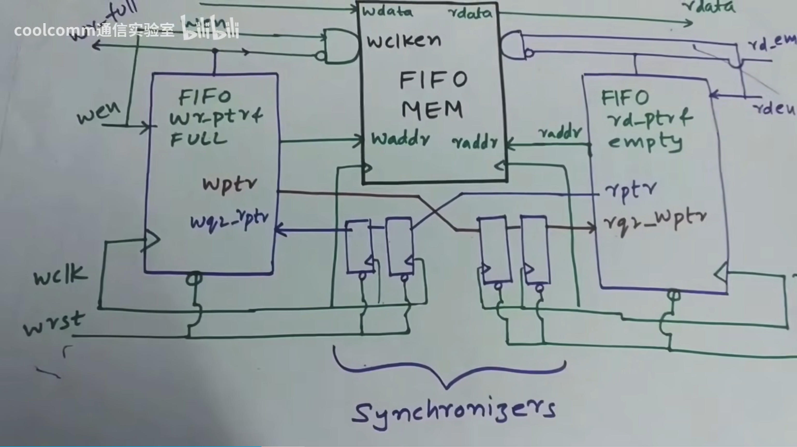

This is a project of an easy Async_fifo based on verilog. I hope it could be a promising beginning of my career. A brief description for modules and signals is provided below.

## Toolchain

iverilog+gtkwave

## Schematic



More details can be found in the [video](https://www.bilibili.com/list/watchlater?oid=115496535984449&bvid=BV1jH1sB5Egp) for reference.

## Signals

### Output

w_full, r_empty

r_data

### Input

m_rst, w_rst, r_rst

w_en, r_en

w_clk, r_clk

w_data


## Modules

### mem

DEPTH = 64 , WIDTH = 32

#### input

m_rst

w_clk, r_clk

w_valid, r_valid

w_addr, r_addr

w_data

#### output

r_data


### w_ptr_ctrl

#### input

w_rst

w_clk

w_en

r_ptr_g_sync

#### output 

w_full

w_ptr_g

w_addr

### r_ptr_ctrl

#### input

r_rst

r_clk

r_en

w_ptr_g_sync

#### output

r_empty

r_ptr_g

r_addr

### bin2gray

Formula for transformation：

```
　　G(i) = B(i+1) XOR B(i); 0 <= i < N - 1
　　G(i) = B(i);      i = N - 1
```

That is to say：

`G = B ^ (B >> 1)`

#### input

binary_format

#### output

gray_format


### gray2bin

Formula for reverse-transformation：

```
　　B(i) = G(i);      i = N - 1
　　B(i) = B(i+1) XOR G(i); 0 <= i < N - 1
```

#### input

gray_format

#### output

binary_format


### synch

2-stage synchronizer

#### input

clk, data

#### output

data_synch
